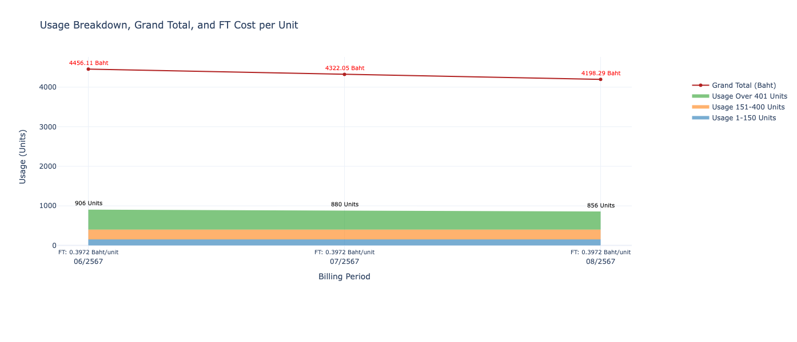

# Invoice Extractor and Plotting Tool



`invoice_extractor` is a Python package that extracts data from PDF invoices and generates CSV files. The tool is designed to handle invoice data extraction while respecting user privacy. Additionally, it provides an interactive plot for usage and cost breakdown based on the extracted CSV data.

## Features
- Extracts key invoice details such as customer account, invoice number, total amount, meter readings, and usage details.
- Generates a structured CSV file from the extracted data.
- Allows optional exclusion of sensitive fields (`customer_account`, `customer_address`) for privacy.
- Provides an easy-to-use command-line interface (CLI) for batch processing of invoices.
- Visualizes the extracted invoice data in an interactive plot (stacked area chart and line chart).
- Annotates the plot with total usage and grand total costs.
- Provides a flexible testing framework using `pytest`.

## Requirements
- Python 3.6 or later
- Required packages: `pdfplumber`, `reportlab`, `plotly`, `pytest`, `nbformat`

## Installation

1. Clone the repository:
    ```bash
    git clone https://github.com/Thirakorn-Mokkawes/invoice_extractor.git
    ```

2. Navigate to the project directory:
    ```bash
    cd invoice_extractor
    ```

3. Install the package:
    ```bash
    pip install .
    ```

## Uninstallation

```bash
pip uninstall invoice_extractor 
```

## Usage

### 1. Invoice Data Extraction (CLI)

Once installed, you can run the tool from the command line using the `invoice-extractor` command.

```bash
invoice-extractor <input_directory> <output_directory> --show_customer_account --show_customer_address
```

- **input_directory**: Directory containing the PDF invoices.
- **output_directory**: Directory to save the CSV output.
- **--show_customer_account**: Optional flag to include the customer account in the output.
- **--show_customer_address**: Optional flag to include the customer address in the output.

#### Example:
```bash
invoice-extractor ./invoices ./output --show_customer_account --show_customer_address
```

### 2. Invoice Data Visualization (CLI)

You can also generate an interactive plot of the extracted invoice data using the `invoice-plot` command. This command allows you to visualize usage details, grand total, and FT cost per unit.

```bash
invoice-plot <input_csv> <output_directory>
```

- **input_csv**: Path to the CSV file containing the invoice data.
- **output_directory**: Directory where the generated plot (HTML format) will be saved.

#### Example:
```bash
invoice-plot ./csv/invoice_data.csv ./plots
```

This will generate an interactive HTML plot in the `./plots` directory.

### 3. Importing in Python or Jupyter Notebooks

You can also import `invoice_extractor` and `plot_area_line_chart_with_labels` for use within a Python script or Jupyter notebook.

#### Example (Data Extraction):
```python
from invoice_extractor.extractor import InvoiceExtractor

pdf_path = "path_to_pdf_invoice.pdf"
extractor = InvoiceExtractor(pdf_path)
invoice_data = extractor.extract_data()

print(invoice_data)
```

#### Example (Data Visualization):
```python
import pandas as pd
from plot.visualizations import plot_area_line_chart_with_labels

# Load the CSV file
csv_file = './invoice_data.csv'
df = pd.read_csv(csv_file)

# Prepare data as a list of dictionaries
data = df.to_dict(orient='records')

# Call the plot function to generate the interactive plot
plot_area_line_chart_with_labels(data)
```

## Testing

The project includes a test suite to ensure the functionality of the invoice extractor and plotting tool. To run the tests, ensure you have `pytest` and `pytest-cov` installed.

### Testing Instructions:

1. **Add your own sample PDFs**:
   You need to place your own `sample_invoice.pdf` and `invalid_invoice.pdf` in the `tests/sample_data/` directory.

2. **Run the tests**:
   ```bash
   pytest --cov=invoice_extractor
   ```

   If you do not provide the necessary PDF files, the tests related to invoice extraction will be skipped.

### Coverage Report

You can also generate a coverage report to see how much of your code is covered by tests:

```bash
pytest --cov=invoice_extractor -rs
```

## Privacy

This tool provides options to protect sensitive information:

- **Customer Account**: You can choose to exclude the customer account number from the CSV output by omitting the `--show_customer_account` flag.
- **Customer Address**: You can choose to exclude the customer address by omitting the `--show_customer_address` flag.

Make sure that you respect the privacy of the data you are working with. When contributing to this project, use mock data or anonymized data in tests and examples.

## Versioning

This project follows [semantic versioning](https://semver.org/). The current version is **v1.1.0**, which includes the new plotting functionality.

## License

This project is licensed under the MIT License - see the [LICENSE](LICENSE) file for details.

## Contact

If you have any questions or need support, feel free to open an issue on the [GitHub repository](https://github.com/Thirakorn-Mokkawes/invoice_extractor) or contact the author.

**Thirakorn Mokkawes, PhD**  
Email: thirakorn.mokkawes@gmail.com

---
